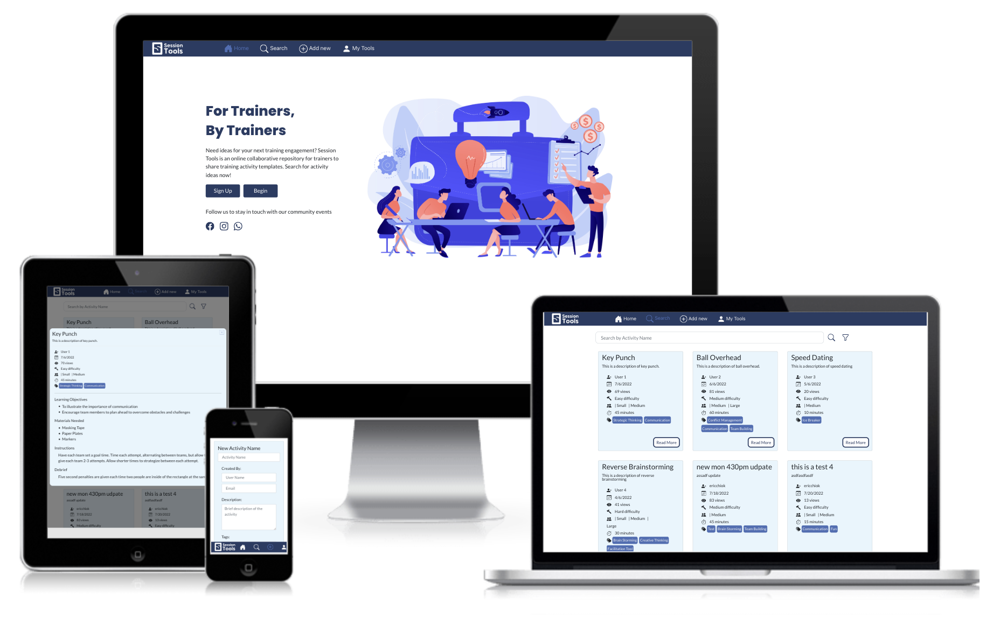
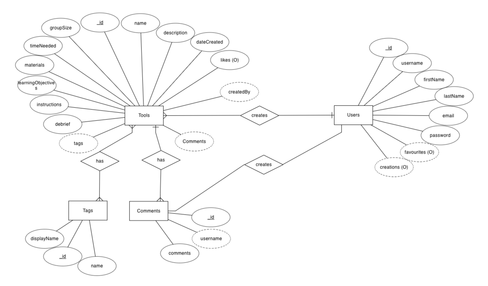
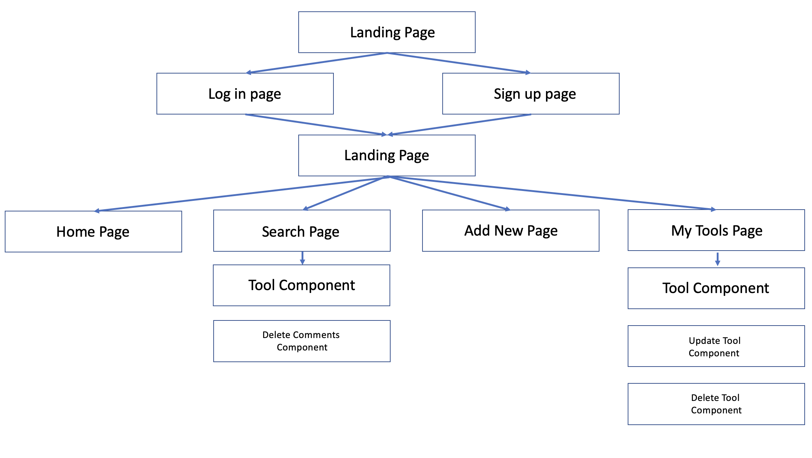
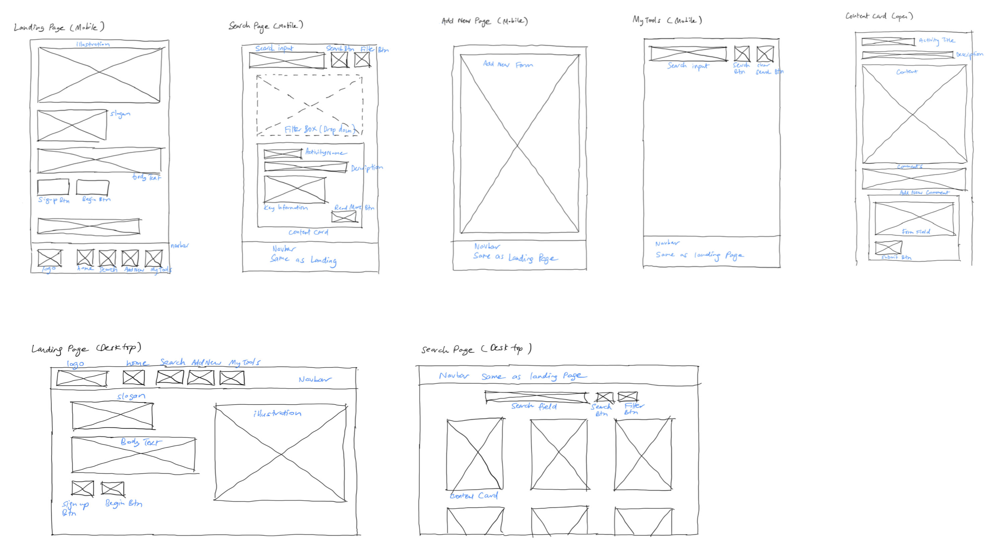

<h1>Session Tools</h1>
</img>

The live demo of the website can be accessed <a href="https://session-tools.netlify.app/">here</a>

<h2>1. Project Summary</h2>

<h3>Project Context</h3>
<ul>

The learning and development industry in Singapore comprises of a majority of freelance professionals. Each trainer usually has their own collection of activities and facilitation tools to rely on based on their own experience. It may be difficult to expand their repertoire of tools due to a lack of time for research. It would be helpful to have a common repository for the community of trainers to contribute and share new ideas for activities and facilitation tools.

</ul>
<h3>Organisation Goals</h3>
<ul>

Session Tools aims to create synergy and community among the freelance learning and development professionals to source for and share ideas for developing and conducting training activities and facilitation tools.

</ul>
<h3>Target Audience</h3>
<ul>

Freelance learning and development professionals who are responsible for classroom facilitation or developing lesson outlines.

</ul>

<h2>2. UI UX</h2>

<h3>2.1 Strategy</h3>
<h4>Organisation Objective</h4>
<ul>

Session tools aims to create an online collaborative platform for learning and development professionals to share ideas for activity templates to use when preparing for workshops. Eventually, users will also be able to use this as a platform to design and build training programme outlines and inserting activity templates into the outlines.

</ul>
<h4>User Story</h4>

<ul>

Sandra is a freelance trainer who is preparing for a new engagement for a corporate team building workshop. The client wants to address conflict management issues within the team, and Sandra is unsure what activites can be conducted to address team building, and how to conduct the debrief of the activity to bring out the learning objectives.

Thomas is a seasoned engineer who recently took up a training role in his company. He is now responsible for staff training, and he is preparing his first training session. He does not have a background in training, and he is researching for ideas on suitable ice breakers and methods to facilitate discussions and he is worried about being able to engage his audience.

Jason has 20 years of experience as a trainer both freelance and inhouse. He is often the go-to for engagement tools in the classroom as he is known among his peers as an excellent facilitator and creative with ideas. He is also active in the adult educator community, and he often wishes there would be a common platform to share his ideas and also to hear how other people have implemented his activity templates, in the event he is able to further improve on them.

</ul>

<h4>User Goals</h4>
<ul>
    <li>Search for activity templates by the following search filters</li>
        <ul>
            <li>Activity Name</li>
            <li>Templates added in the last month</li>
            <li>Minimum time and maximum time</li>
            <li>Level of difficulty</li>
            <li>Tags (eg. communication, ice breaker, etc)</li>
            <li>Group size</li>
        </ul>
    <li>View key information about each activity</li>
        <ul>
            <li>Materials needed</li>
            <li>Learning objectives</li>
            <li>Activity instructions</li>
            <li>Debrief instructions</li>
        </ul>
    <li>Contribute by adding an template to the repository for other users to search</li>
    <li>Comment on any activity template to suggest improvements and customisations or encourage the creator</li>
    <li>Edit and delete templates that were added by user</li>
</ul>

<h3>2.2 Scope</h3>
<h4>Features</h4>

<ul>
<h4>Content</h4>
<ul>
    <li>Activity Name</li>
    <li>Description of activity</li>
    <li>Created by</li>
    <li>Date created</li>
    <li>Views</li>
    <li>Difficulty level</li>
    <li>Group size</li>
    <li>Time needed</li>
    <li>Tags</li>
    <li>Materials needed</li>
    <li>Learning objectives</li>
    <li>Instructions</li>
    <li>Debrief Instructions</li>
</ul>
</ul>
<h4>Non Functional Requirements</h4>
<ul>

Session Tools should be a mobile responsive application developed with a mobile first design approach.

</ul>

<h3>2.3 Database and Website Architecture</h3>
<h4>Database</h4>
</img>
<h4>Website</h4>
<!-- insert mockups here -->
</img>

<h3>2.4 UI Skeleton</h3>
<!-- insert mockups here -->
</img>

<h3>2.5 Surface</h3>
<h4>Colors</h4>
<ul>
</img>

#e8f5fd, #D0ECFB, #a4b5da, #4a6eb5, #283C63

</ul>
<h4>Fonts</h4>
<ul>

Lato, Poppins

Sans serif fonts are a popular choice for designing e-learning related materials due to its readability and comfort for users to read. Lato is popular for this reason, coupled with its rounded design that creates a professional look, making it an ideal choice for body text in a website meant for learning and development professionals. Poppins is used for the slogan on the landing page for its heavier font weight and narrower spacing.

</ul>
<h4>Icons</h4>

All interface icons are taken from Bootstrap Icons. See credits.

<h2>3. Features</h2>

<h3>Key Features</h3>
<ul>
    <li>Dynamic form fields for materials and learning objectives form field</li>
        <ul>
            <li>An empty array of objects was first created for the field. The element object (input field, add button, remove button) was rendered based on how many objects are in the array. Two way binding is achieved between the input field and the object input field. The on change function also includes looping through the array of objects to generate an array of strings to be passed as params via the axios call. The reverse is done to display the existing elements in the edit component.</li>
            <li>A condition is also added to only display the remove button if there are 2 or more element objects to prevent users from removing the field entirely</li>
        </ul>
    <li>Rich text editor for instructions and debrief form field to allow users flexibility in writing</li>
        <ul>
            <li>Installed the CK Editor package using the inbuilt "Classic Editor" configuration. This allows users to make use of the most of the html styling options except for adding media. React-HTML-parser was used to then display the input data on the content cards.</li>
        </ul>
    <li>Creatable multi select for tags form field</li>
        <ul>
            <li>Installed the react-select package and made use of the creatable multi select feature. This package returns the selected data in an array of objects {label, value}. A function is needed to extract the all the label values into an array of strings to be passed as params via the axios call. The reverse is done to display the existing elements as selected tags (as an option "selected") into the edit component.</li>
        </ul>
    <li>Email validation for edit and deleting tools</li>
        <ul>
            <li>Users are required to provide a valid email when creating a new tool. The email is always left out in projection during the api call to prevent others from . At the my tools component, users will first need to provide their email address to retrieve only the tools that they have created. This will return a list of tools tagged to that email address and open edit and delete rights. </li>
        </ul>
    <li>Email validation for delete comments</li>
        <ul>
            <li>Users are required to provide an email address when deleting a comment. A separate search route is created on express using the aggregrate function to only return the comment object that matches both the tool_id and the email provided. If there is a return result, the user has been authenticated and delete is processed. If there is no return result, user has not been authenticated and error message is returned.</li>
        </ul>
</ul>
<h3>Limitations and Future Implementations</h3>
<table>
    <tr>
        <th>No.</th>
        <th>Limitations</th>
        <th>Future Implementations</th>
    </tr>
    <tr>
        <td>1</td>
        <td>User is currently unable to insert media (images / videos)</td>
        <td>User will be allowed to input images and videos of activity to make it easier for others to refer to their activity templates. Media will be stored in MongoDB, and allowed in CK Editor.</td>
    </tr>
    <tr>
        <td>2</td>
        <td>Users are not required to log in for CRUD</td>
        <td>Log in accounts will be implemented for all users before they are able to access content on the website. Add Tools page will be combined with My Tools page. An additional My Favourites page will be added to allow users to save their favourite tools.</td>
    </tr>
    <tr>
        <td>3</td>
        <td>There is no role available to moderate the comments section</td>
        <td>Admin and moderator roles will be added that will have permissions to delete comments and posts</td>
    </tr>
    <tr>
        <td>4</td>
        <td>Users are only able to view individual activities, but cannot build a complete programme outline</td>
        <td>An additional Build Outline page will be added to allow users to build a programme outline and include existing activities into their outline. They will also be able to export and print the outline for different purposes (for client, for trainers) which will filter the amount of information shown respectively</td>
    </tr>
</table>

<h2>4. Test Cases</h2>

The documentation for test cases can be accessed <a href="https://1drv.ms/x/s!ArFMW1hSgH5_gacNw685d-OXmTEPEg?e=GlwMPm">here</a>

<h2>5. Deployment</h2>

The API is deployed using Heroku

The React application is manually deployed using Netlify

<h2>6. Technologies Used</h2>

<table>
    <tr>
        <th>Technology</th>
        <th>Uses</th>
    </tr>
    <tr>
        <td>MongoDB</td>
        <td>Database hosting</td>
    </tr>
    <tr>
        <td>MongoDB Node Driver</td>
        <td>To access MongoDB from Express</td>
    </tr>
    <tr>
        <td>Axios</td>
        <td>API calls</td>
    </tr>
    <tr>
        <td>HTML React Parser</td>
        <td>Display data from rich text editor into formatted html</td>
    </tr>
    <tr>
        <td>CK Editor</td>
        <td>Instructions and Debrief form field inputs</td>
    </tr>
    <tr>
        <td>ExpressJS</td>
        <td>Backend application</td>
    </tr>
    <tr>
        <td>ReactJS</td>
        <td>Frontend application</td>
    </tr>
    <tr>
        <td>React-select</td>
        <td>Create user editable multi select tags for tags form field input</td>
    </tr>
    <tr>
        <td>BootStrap / CSS</td>
        <td>Styling of html elements in React application</td>
    </tr>
    <tr>
        <td>Heroku</td>
        <td>Deployment of Express API</td>
    </tr>
    <tr>
        <td>Netlify</td>
        <td>Deployment of React application</td>
    </tr>
    <tr>
        <td>dotenv</td>
        <td>To enable use of .env file</td>
    </tr>
    <tr>
        <td>CORS</td>
        <td>To enable cross origin resource sharing for API</td>
    </tr>
</table>

<h2>7. Credits</h2>

Bootstrap icons: [https://icons.getbootstrap.com/]

Muzli for creating color palette: https://colors.muz.li/palette/e8f5fd/d0ecfb/a4b5da/4a6eb5/283c63

Looka for logo creation: https://looka.com/editor/91955174

Create Mockup: https://www.createmockup.com/generate/

Creatable Multi Select: https://react-select.com/creatable

CK Editor: https://ckeditor.com/
