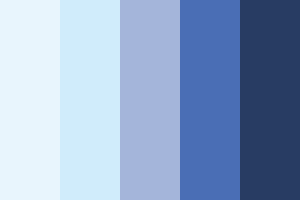

<h1>Session Tools</h1>
</img>

The live demo of the website can be accessed <a href="https://session-tools.netlify.app/">here</a>

<h2>1. Project Summary</h2>

<h3>Project Context</h3>

The learning and development industry in Singapore comprises of a majority of freelance professionals. Each trainer usually has their own collection of activities and facilitation tools to rely on based on their own experience. It may be difficult to expand their repertoire of tools due to a lack of time for research. It would be helpful to have a common repository for the community of trainers to contribute and share new ideas for activities and facilitation tools.

<h3>Organisation Goals</h3>

Session Tools aims to create synergy and community among the freelance learning and development professionals to source for and share ideas for developing and conducting training activities and facilitation tools.

<h3>Target Audience</h3>

Freelance learning and development professionals who are responsible for classroom facilitation or developing lesson outlines.

<h2>2. UI UX</h2>

<h3>2.1 Strategy</h3>
<h4>Organisation Objective</h4>

Session tools aims to create an online collaborative platform for learning and development professionals to share ideas for activity templates to use when preparing for workshops. Eventually, users will also be able to use this as a platform to design and build training programme outlines and inserting activity templates into the outlines.

<h4>User Story</h4>

Sandra is a freelance trainer who is preparing for a new engagement for a corporate team building workshop. The client wants to address conflict management issues within the team, and Sandra is unsure what activites can be conducted to address team building, and how to conduct the debrief of the activity to bring out the learning objectives.

Thomas is a seasoned engineer who recently took up a training role in his company. He is now responsible for staff training, and he is preparing his first training session. He does not have a background in training, and he is researching for ideas on suitable ice breakers and methods to facilitate discussions and he is worried about being able to engage his audience.

Jason has 20 years of experience as a trainer both freelance and inhouse. He is often the go-to for engagement tools in the classroom as he is known among his peers as an excellent facilitator and creative with ideas. He is also active in the adult educator community, and he often wishes there would be a common platform to share his ideas and also to hear how other people have implemented his activity templates, in the event he is able to further improve on them.

<h3>2.2 Scope</h3>
<h4>Features</h4>
<ul>
    <li>Search for activity templates by the following search filters</li>
        <ul>
            <li>Activity Name</li>
            <li>Templates added in the last month</li>
            <li>Minimum time and maximum time</li>
            <li>Level of difficulty</li>
            <li>Tags (eg. communication, ice breaker, etc)</li>
            <li>Group size</li>
        </ul>
    <li>View key information about each activity</li>
        <ul>
            <li>Materials needed</li>
            <li>Learning objectives</li>
            <li>Activity instructions</li>
            <li>Debrief instructions</li>
        </ul>
    <li>Contribute by adding an template to the repository for other users to search</li>
    <li>Comment on any activity template to suggest improvements and customisations or encourage the creator</li>
    <li>Edit and delete templates that were added by user</li>
</ul>

<h4>Content</h4>
<ul>
    <li>Activity Name</li>
    <li>Description of activity</li>
    <li>Created by</li>
    <li>Date created</li>
    <li>Views</li>
    <li>Difficulty level</li>
    <li>Group size</li>
    <li>Time needed</li>
    <li>Tags</li>
    <li>Materials needed</li>
    <li>Learning objectives</li>
    <li>Instructions</li>
    <li>Debrief Instructions</li>
</ul>
<h4>Non Functional Requirements</h4>

Session Tools should be a mobile responsive application developed with a mobile first design approach.

<h3>2.3 Database and Website Architecture</h3>
<h4>Database</h4>
<h4>Website</h4>

<h3>2.4 UI Skeleton</h3>
<!-- insert mockups here -->

<h3>2.5 Surface</h3>
<h4>Colors</h4>
</img>

#e8f5fd, #D0ECFB, #a4b5da, #4a6eb5, #283C63

<h4>Fonts</h4>

Lato, Poppins

Sans serif fonts are a popular choice for designing e-learning related materials due to its readability and comfort for users to read. Lato is popular for this reason, coupled with its rounded design that creates a professional look, making it an ideal choice for body text in a website meant for learning and development professionals. Poppins is used for the slogan on the landing page for its heavier font weight and narrower spacing.

<h4>Icons</h4>

<h2>3. Features</h2>

<h3>Features</h3>
<ul>
</ul>
<h3>Limitations and Future Implementations</h3>
<table>
    <tr>
        <th>No.</th>
        <th>Limitations</th>
        <th>Future Implementations</th>
    </tr>
    <tr>
        <td>1</td>
        <td>test</td>
        <td>test</td>
    </tr>
</table>

<h2>4. Test Cases</h2>

The documentation for test cases can be accessed <a href="https://1drv.ms/x/s!ArFMW1hSgH5_gacNw685d-OXmTEPEg?e=GlwMPm">here</a>

<h2>5. Deployment</h2>

The API is deployed using Heroku

The React application is deployed using Netlify

<h2>6. Technologies Used</h2>

<table>
    <tr>
        <th>Technology</th>
        <th>Uses</th>
    </tr>
    <tr>
        <td>MongoDB</td>
        <td></td>
    </tr>
    <tr>
        <td>ExpressJS</td>
        <td></td>
    </tr>
    <tr>
        <td>ReactJS</td>
        <td></td>
    </tr>
    <tr>
        <td>BootStrap / React-Bootstrap</td>
        <td></td>
    </tr>
    <tr>
        <td>Heroku</td>
        <td></td>
    </tr>
    <tr>
        <td>Netlify</td>
        <td></td>
    </tr>
</table>

<h2>7. Credits</h2>

Bootstrap icons: [https://icons.getbootstrap.com/]

Muzli for creating color palette: https://colors.muz.li/palette/e8f5fd/d0ecfb/a4b5da/4a6eb5/283c63

Looka for logo creation: https://looka.com/editor/91955174

Create Mockup: https://www.createmockup.com/generate/
